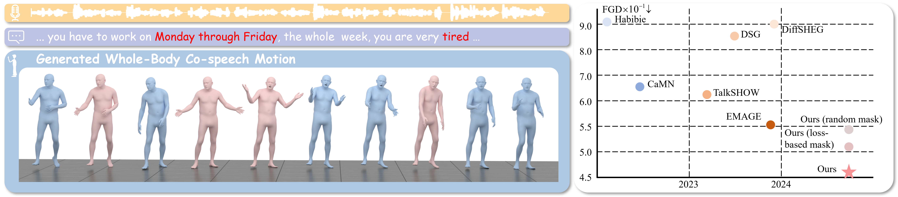

<div align="center">
<h2><font> </font></center> <br> <center>EchoMask: Speech-Queried Attention-based Mask Modeling for Holistic Co-Speech Motion Generation</h2>

[Xiangyue Zhang\*](https://xiangyue-zhang.github.io/), [Jianfang Li\*](https://github.com/Xiangyue-Zhang/EchoMask), [Jiaxu Zhang](https://kebii.github.io/), [Jianqiang Ren](https://github.com/JianqiangRen), [Liefeng Bo](https://scholar.google.com/citations?user=FJwtMf0AAAAJ&hl=en), [Zhigang Tu†](http://tuzhigang.cn/)

<a href='https://arxiv.org/abs/2504.09209'></a> <a href='https://xiangyue-zhang.github.io/EchoMask/'></a>

<br>
<br>

</div>

# 📣 Updates

- **[2025.09.11]** 🔥 Release: - [✔] Inference code - [✔] Training code

# 💖 Inference Data

If you would like to compare your paper’s results with EchoMask but find it too difficult to run the repository, you can simply download the test `.npz` file from [Google Drive](https://drive.google.com/file/d/1MZQMWf4Vk4DDK73U_WIamDwIeBRzR4Tc/view?usp=sharing).

# ⚒️ Quick Start

## Build Environtment

We Recommend a python version `=3.8` and cuda version `>=12.1`. Then build environment as follows:

```shell
# [Optional] Create a virtual env
conda create -n EchoMask python=3.8
conda activate EchoMask
# pytorch, torchvison
conda install pytorch==2.1.0 torchvision==0.16.0 torchaudio==2.1.0 pytorch-cuda=12.1 -c pytorch -c nvidia
# Install with pip:
pip install -r requirements.txt
sudo apt-get update && sudo apt-get install -y ffmpeg  # if you don't have ffmpeg
```

## Download Data

please refer to [EMAGE](https://github.com/PantoMatrix/PantoMatrix/tree/main) and download datasets from [BEAT2](https://huggingface.co/datasets/H-Liu1997/BEAT2) for datasets and place the dataset inside the EchoMask folder, i.e. `path-to-EchoMask/BEAT2`

## Download Weights

Download [hubert-large-ls960-ft](https://huggingface.co/facebook/hubert-large-ls960-ft)(used for extracting audio features) weights and place itside in the EchoMask folder, i.e. `path-to-EchoMask/facebook`.
If you are in China, you can use hf-mirror for faster and more reliable downloads. The process may take some time, so please be patient.

```
pip install -U huggingface_hub
export HF_ENDPOINT=https://hf-mirror.com
huggingface-cli download --resume-download facebook/hubert-large-ls960-ft --local-dir facebook/hubert-large-ls960-ft
```

Download [pretrained models and weights](https://drive.google.com/file/d/1nQqkHT27avQl_YoecHc8gBVuF_0aP5Bb/view?usp=sharing) from google drive, unzip and place it in the EchoMask folder, i.e. `path-to-EchoMask/weights`.

Finally, these EchoMask folder should be orgnized as follows:

```text
.
├── BEAT2
│   └── beat_english_v2.0.0
├── configs
├── dataloaders
├── datasets   (this folder will appear after you generate the datasets)
│   ├── beat2_cache2
│   ├── beat2_echomask_train
│   └── echomask_dataloader.py
├── facebook
│   └── hubert-large-ls960-ft
├── models
├── optimizers
├── src
├── utils
├── weights
│   ├── pretrained_vq
│   ├── smplx_models
│   └── best_echomask.bin
├── ae_trainer.py
├── aeface_trainer.py
├── aelower_trainer.py
├── aelowerfoot_trainer.py
├── requirements.txt
├── echomask_trainer.py
├── echomask_trainer.py
└── train.py
```

## Generate Dataset

**Notice**: Please make sure you are in the root directory, i.e. `path-to-EchoMask`.

1. To generate the training dataset, run:

```shell
python dataloaders/save_train_dataset.py # generate train dataset
```

This process may take some time, so please be patient.

2. To generate the test dataset, run:

```shell
python dataloaders/save_test_dataset.py # generate test dataset
```

# 🚀Training, Testing, and Inference

## Training of EchoMask

### Train RVQ-VAE

You can either train your own RVQ-VAE weights and place them under `path-to-EchoMask/weights` using the commands below, or simply use our [pretrained weights](https://drive.google.com/file/d/1nQqkHT27avQl_YoecHc8gBVuF_0aP5Bb/view?usp=sharing).

```shell
torchrun --nproc_per_mode=1 train.py --train_rvq --config configs/cnn_vqvae_face_30.yaml # face
```

```shell
torchrun --nproc_per_mode=1 train.py --train_rvq --config configs/cnn_vqvae_hands_30.yaml # hands
```

```shell
torchrun --nproc_per_mode=1 train.py --train_rvq --config configs/cnn_vqvae_upper_30.yaml # upper body
```

```shell
torchrun --nproc_per_mode=1 train.py --train_rvq --config configs/cnn_vqvae_lower_foot_30.yaml # lower foot
```

```shell
torchrun --nproc_per_mode=1 train.py --train_rvq --config configs/cnn_vqvae_lower_30.yaml # lower body
```

### Training of EchoMask

```shell
torchrun --nproc_per_mode=1 train.py --config configs/echomask.yaml
```

## Testing of EchoMask

**Notice**: Before running the test code, make sure the `load_ckpt` and `base_ckpt` paths in `configs/echomask.yaml` are set correctly.

```shell
torchrun --nproc_per_mode=1 train.py --test_state --config configs/echomask.yaml
```

## Inference

you can put your inference wav format aduio on `./demo` path, for example, you can run:

```shell
torchrun --nproc_per_mode=1 train.py --inference --config configs/echomask.yaml --audio_infer_path ./demo/2_scott_0_1_1_test.wav
```

# 📺 Visualize

Following [EMAGE](https://github.com/PantoMatrix/PantoMatrix), you can download [SMPLX blender addon](https://huggingface.co/datasets/H-Liu1997/BEAT2_Tools/blob/main/smplx_blender_addon_20230921.zip), and install it in your blender 3.x or 4.x. Click the button Add Animation to visualize the generated smplx file (like xxx.npz).

# 🙏 Acknowledgments

Thanks to [EMAGE](https://github.com/PantoMatrix/PantoMatrix/tree/main/scripts/EMAGE_2024), [DiffSHEG](https://github.com/JeremyCJM/DiffSHEG), our code is partially borrowing from them. Please check these useful repos.

# 📖 Citation

If you find our code or paper helps, please consider citing:

```bibtex
@article{zhang2025echomask,
  title={EchoMask: Speech-Queried Attention-based Mask Modeling for Holistic Co-Speech Motion Generation},
  author={Zhang, Xiangyue and Li, Jianfang and Zhang, Jiaxu and Ren, Jianqiang and Bo, Liefeng and Tu, Zhigang},
  journal={arXiv preprint arXiv:2504.09209},
  year={2025}
}
```
